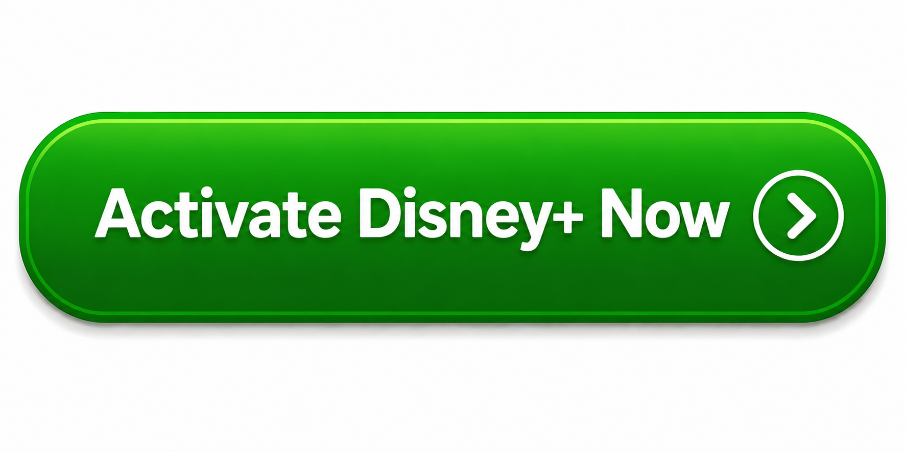

DisneyPlus.com/Begin | Enter Your 8-Digit Code & Activate Disney+
=================================================================

If your TV displays an **8-digit Disney+ activation code**, you can quickly connect your device by visiting **DisneyPlus.com/Begin**. Simply open the Disney+ app on your Smart TV, Roku, Fire TV, Apple TV, gaming console, or another supported streaming device, then enter the code shown on your screen. After signing in with your Disney+ account, your device will activate automatically, allowing you to stream your favorite movies, TV shows, Pixar, Marvel, Star Wars, and National Geographic content.

How to Activate Disney+ with an 8-Digit Code
--------------------------------------------

#. Open the **Disney+** app on your TV or streaming device.
#. Select **Log In** to display the **8-digit activation code**.
#. On a phone or computer, visit **DisneyPlus.com/Begin**.
#. Sign in using your Disney+ account email and password.
#. Enter the **8-digit code** exactly as shown on your TV.
#. Select **Continue** to verify the code.
#. Wait a few seconds for your TV to refresh automatically.
#. Start streaming Disney+ content.

Why Your Disney+ Code May Not Work
----------------------------------

* The activation code has expired—generate a new one.
* The code was entered incorrectly.
* You're signed in with the wrong Disney+ account.
* Your internet connection is unstable.
* The Disney+ app needs to be updated.
* Restart the app or your streaming device and try again.

Supported Devices
-----------------

* Smart TVs (Samsung, LG, Android TV)
* Roku
* Amazon Fire TV
* Apple TV
* Chromecast
* PlayStation
* Xbox
